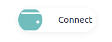
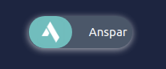
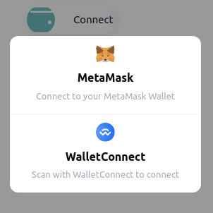
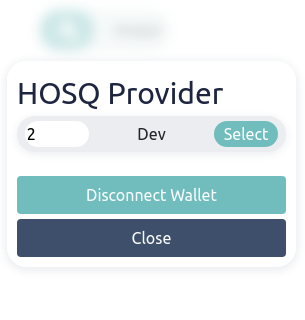

# Wallet

## A wallet component for [Arag](https://github.com/anspar/arag) nApps.






### Requirements 
[arag common libs](https://github.com/anspar/arag_common_libs)

### Import 
In html file
```
    <div style="width: 130px; height: 40px;">
        {{web_component "https://github.com/anspar/wallet/releases/download/<release-version>/build.html"}}
    </div>
```

#### OR
Download the `build.html` file and add it to the project with
```
    {{import_content "path/to/build.html"}}
```


### Setup wallet
If user owns the ANS the profile will be loaded, otherwise wallet address will be shown.
```
const private = {{import_json "private.json"}};
$(document).ready(async () => {
    WALLET.providerOptions = { // optional
        walletconnect: {
            package: WalletConnectProvider.default,
            options: {
                infuraId: private.INFURA_ID 
            }
        }
    };

    await WALLET.setup(); // required
})
```
Somewhere else
```
    await WALLET.until_ready(); // will block until wallet is connected
```

## Available Objects
### WALLET
    addressToShort: ƒ (address)
    connect: async ƒ ()
    disconnect: async ƒ ()
    getProvider: ƒ ()
    getSigner: ƒ ()
    is_ready: async ƒ ()
    network: {chainId, name}
    providerOptions: {}
    setup: async ƒ ()
    setup_contract: ƒ (networks:{id:address}, abi, contractName)
    showANS: async ƒ ()
    signMessage: async ƒ (message)
    until_ready: async ƒ ()
    updateDetails: async ƒ (callback)
    user_address: string
    _instance: web3Modal instance
    _provider: ethers-5 provider
    _web3Modal: L 

### HOSQ
    contract: ethers-5 instance
    gateway: string
    get: async ƒ (cid)
    is_ready: ƒ ()
    provider: object
    select_provider: async ƒ (id)
    setup: async ƒ ()
    upload: async ƒ (data, json, dir, progress?)
    upload_dir: async ƒ (files, json, dir_name, info?, progress?)

### ANS
    contract: ethers-5 instance
    getDefaultANS: async ƒ ()
    is_ready: ƒ ()
    setup: async ƒ ()

### Note
You can always get all available attributes with `Object.keys(<Object Name>)`
## Ask questions at [Discord](https://discord.gg/ENQfPEcrZJ)





[anspar.io](https://anspar.io)
